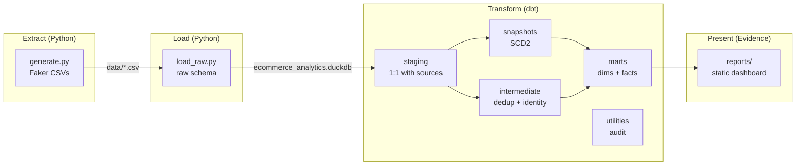

# Architecture

End-to-end flow for the local e-commerce analytics stack. See
[DESIGN.md](DESIGN.md) for decision rationale on each layer.

## Layers

| Layer | Location | Role |
|-------|----------|------|
| **Extract** | `scripts/generate.py` | Deterministic mock CDC + append-only events |
| **Load** | `scripts/load_raw.py` | Land CSVs into DuckDB `raw` schema (E/L boundary) |
| **Staging** | `models/staging/` | Cast, rename, light cleanup; 1:1 with sources |
| **Snapshots** | `snapshots/` | SCD2 history for users and products |
| **Intermediate** | `models/intermediate/` | Session dedup, cross-source identity resolution |
| **Marts** | `models/marts/` | Conformed dims, incremental facts, daily aggregates |
| **Audit** | `models/utilities/`, `tests/` | Late-arrival SLA surface + warn-only test |
| **Dashboard** | `reports/` | Evidence.dev static site over DuckDB marts |

## CI

| Workflow | Trigger | Purpose |
|----------|---------|---------|
| [`ci.yml`](../.github/workflows/ci.yml) | push / PR | pre-commit lint + `dbt build` on generated data |
| [`deploy-dashboard.yml`](../.github/workflows/deploy-dashboard.yml) | push to `master` | Build warehouse + publish Evidence to GitHub Pages |
