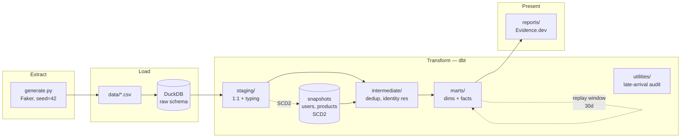

# Architecture

The pipeline is split along the classic E / L / T boundary, with snapshot capture sitting between staging and downstream transforms. Each layer has one job; nothing is conflated.

## E and L separated from T

`scripts/generate.py` writes CSVs. `scripts/load_raw.py` lands them in a `raw` schema in DuckDB. dbt runs against `raw`. The alternative — `meta: external_location` on sources — was rejected because it conflates loading and transformation. Production warehouses are typically fed by a managed ingestion tool (Fivetran, Debezium, Airbyte) writing into a landing schema, and the local pipeline mirrors that boundary.

The practical payoff: swapping the simulator for a real ingestion tool is a one-line change to `_sources.yml`; nothing downstream cares where the rows came from.

## Snapshots cover CDC sources only

| Source        | Pattern       | Snapshotted |
|---------------|---------------|-------------|
| users         | CDC           | yes         |
| products      | CDC           | yes         |
| transactions  | CDC           | no          |
| sessions      | append-only   | no          |

Transactions are CDC but their mutating attributes (`status`, `refund_amount`, `refunded_at`) are **terminal** — a row refunds once. The latest row carries all history the marts require. Partial refunds or chargebacks would invalidate this and require a snapshot.

`hard_deletes: new_record` is set so a removed `user_id` records a deletion-event row rather than appearing current indefinitely.

## Snapshots are not enriched

Snapshots capture staging models verbatim. Derived columns (`canonical_user_id`) are computed in `int_users`, downstream of the snapshot. Snapshotting a derivation means any change to the derivation logic rewrites historical `dbt_valid_from` values — which silently corrupts the audit trail you set up snapshots to provide.

## Bounded resolution replay

`fct_sessions` and `fct_transactions` are incremental on `_ingested_at`. That alone strands fact rows whose dim FK was still the default SK at first load: when the late-arriving dim row finally appears, the fact does not reprocess.

Each incremental run additionally re-pulls fact rows where the dim SK is still the default *and* the event time is within `dim_resolution_replay_days` (30 by default). Outside that window, unresolved rows are treated as permanently default and removed from the replay set.

Two project vars control the windows:

| Var | Default | Used in |
|---|---|---|
| `session_lookback_days` | 3 | `fct_daily_sessions`, late-arrival audit, SLA breach test |
| `dim_resolution_replay_days` | 30 | Replay set for `fct_sessions` / `fct_transactions` |

Both live in `dbt_project.yml` so the windows stay consistent across the pipeline.

## CI and deployment

| Workflow | Trigger | Purpose |
|---|---|---|
| `ci.yml` | push / PR | pre-commit lint + `dbt build` on generated data |
| `deploy-dashboard.yml` | push to `master` | Build warehouse + publish Evidence to GitHub Pages |

The live dashboard is at [ukiah-heasley.github.io/ecommerce-analytics-dbt](https://ukiah-heasley.github.io/ecommerce-analytics-dbt/). Deploy setup and troubleshooting live in [`docs/DEPLOY.md`](https://github.com/Ukiah-Heasley/ecommerce-analytics-dbt/blob/master/docs/DEPLOY.md) in the repo.

## Where to go next

- [[Data-Model]] — what each mart looks like
- [[Edge-Cases]] — the ingestion patterns that drive these architectural choices
- [[Design-Decisions]] — broader rationale and out-of-scope notes
