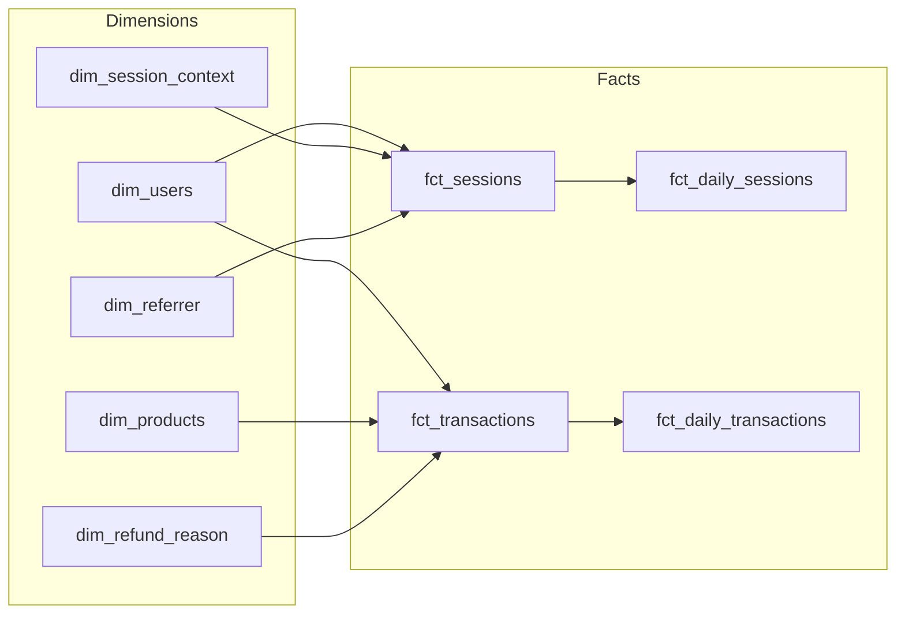

# Data Model

Two grains, two roles: **dims** describe entities, **facts** describe events. Every fact joins to every dim via a default-row hash so unresolved FKs never become null aggregations.



## Marts catalog

### Dimensions

| Model | Grain | Source of truth |
|---|---|---|
| `dim_users` | one row per canonical user version (SCD2) | `snapshots/users` + `int_users` (identity resolution) |
| `dim_products` | one row per product version (SCD2) | `snapshots/products` |
| `dim_session_context` | one row per device × browser × OS triple | derived in mart |
| `dim_referrer` | one row per referrer host | derived in mart |
| `dim_refund_reason` | one row per refund reason code | derived in mart |

### Facts

| Model | Grain | Materialization | Notes |
|---|---|---|---|
| `fct_sessions` | one row per session | incremental on `_ingested_at` | Bounded replay for late dim resolution |
| `fct_transactions` | one row per transaction | incremental on `_ingested_at` | Refund mutates the original row |
| `fct_daily_sessions` | one row per day | view | Rolling windows reference `session_lookback_days` |
| `fct_daily_transactions` | one row per day | view | Source for the Evidence dashboard KPIs |

## Default-row pattern for unresolved FKs

Every dim contains a default row keyed by `md5('unknown')`. Facts `coalesce(...)` to that hash when a dim lookup misses, so unresolved FKs become **joinable rows** rather than nulls that break aggregations.

The `default_sk` macro is the single source of truth for the hash expression. This prevents drift between the fact's `coalesce` and the dim's `union all` — if you change the unknown sentinel value, both sides update from one place.

Without this pattern, an `inner join` silently drops fact rows; a `left join` leaves nulls that poison `sum()` and `count(distinct)` in subtly different ways depending on the engine. The default row makes "we don't know" an explicit, queryable category.

## Point-in-time joins on event time

Facts join dims on:

```sql
join dim_products dp
  on ft.product_id = dp.product_id
  and ft.event_at >= dp.valid_from
  and (ft.event_at < dp.valid_to or dp.valid_to is null)
```

Each event resolves to the dim version **current at the event's timestamp**, not at load time. A transaction recorded against a $50 product remains attributed to the $50 version even after a subsequent price change. This is what makes historical revenue attribution defensible.

## Lookback windows as project vars

`session_lookback_days` and `dim_resolution_replay_days` are defined in `dbt_project.yml`:

```yaml
vars:
  session_lookback_days: 3
  dim_resolution_replay_days: 30
```

The sliding window in `fct_daily_sessions`, the late-arrival audit, and the SLA breach test all reference `session_lookback_days`. Changing the SLA is a one-line config edit — no model rewrites — and every downstream consumer stays in lockstep.

## Where to go next

- [[Edge-Cases]] — the ingestion realities these dims and facts are designed to absorb
- [[Architecture]] — how the layers fit together
- [[Dashboard]] — what the facts look like once rendered
